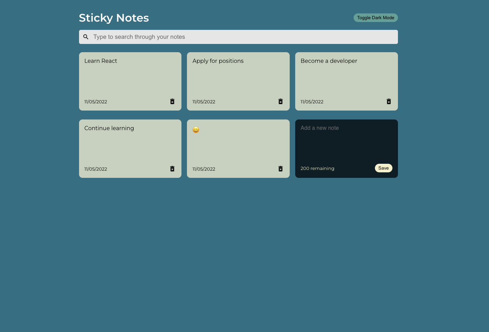
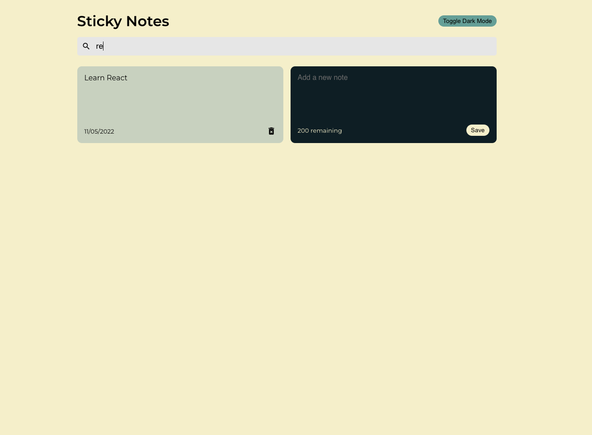

# React Sticky Notes Application

This React app is web platform version of the popular Stickies macOS application. It allows users to enter in a character-limited sized note for future reference. Data persistence for this version utilises local storage. Users are also able to search through their notes with an input string that filters out any that don't match their search string.

## Tech Stack

**Client:** React

## Demo

App can be found at the following [link](https://react-sticky-note-app-mo.netlify.app).

## Screenshots

## What did I get to practice

- functional React components
- React hooks for state management
- data persistence using local storage

## Roadmap

- Animations (maybe with Framer Motion)
- Authentication
- Server-side data persistence
- Adding image upload feature for each sticky note
- React Native version
